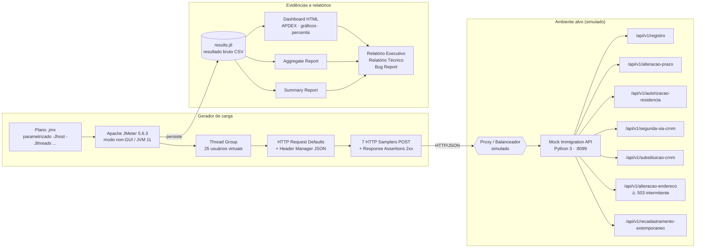

# Diagrama de Arquitetura da Solução de Teste

Visão dos componentes envolvidos na execução e na geração de evidências.

```mermaid
flowchart LR
    subgraph GERADOR["Gerador de carga"]
        JMX[Plano .jmx<br/>parametrizado -Jhost -Jthreads ...]
        JM[Apache JMeter 5.6.3<br/>modo non-GUI / JVM 11]
        TG[Thread Group<br/>25 usuários virtuais]
        HD[HTTP Request Defaults<br/>+ Header Manager JSON]
        SM[7 HTTP Samplers POST<br/>+ Response Assertions 2xx]
        JMX --> JM --> TG --> HD --> SM
    end

    subgraph ALVO["Ambiente alvo (simulado)"]
        LB{{Proxy / Balanceador<br/>simulado}}
        API[Mock Immigration API<br/>Python 3 · :8099]
        E1["/api/v1/registro"]
        E2["/api/v1/alteracao-prazo"]
        E3["/api/v1/autorizacao-residencia"]
        E4["/api/v1/segunda-via-crnm"]
        E5["/api/v1/substituicao-crnm"]
        E6["/api/v1/alteracao-endereco<br/>⚠️ 503 intermitente"]
        E7["/api/v1/recadastramento-extemporaneo"]
        LB --> API
        API --> E1 & E2 & E3 & E4 & E5 & E6 & E7
    end

    subgraph EVIDENCIAS["Evidências e relatórios"]
        JTL[(results.jtl<br/>resultado bruto CSV)]
        DASH[Dashboard HTML<br/>APDEX · gráficos · percentis]
        AGG[Aggregate Report]
        SUMM[Summary Report]
        DOCS[Relatório Executivo<br/>Relatório Técnico<br/>Bug Report]
        JTL --> DASH
        JTL --> AGG
        JTL --> SUMM
        DASH --> DOCS
        AGG --> DOCS
        SUMM --> DOCS
    end

    SM -- HTTP/JSON --> LB
    JM -- persiste --> JTL
```
