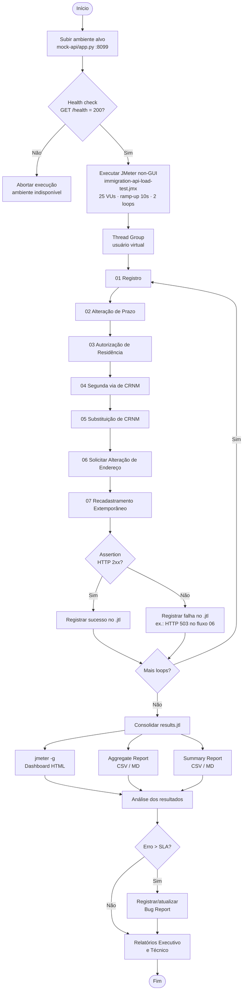

# Fluxograma do Teste de Performance

Fluxo de execução do plano de teste, do setup à publicação dos relatórios.

```mermaid
flowchart TD
    A([Início]) --> B[Subir ambiente alvo<br/>mock-api/app.py :8099]
    B --> C{Health check<br/>GET /health = 200?}
    C -- Não --> Z1[Abortar execução<br/>ambiente indisponível]
    C -- Sim --> D[Executar JMeter non-GUI<br/>immigration-api-load-test.jmx<br/>25 VUs · ramp-up 10s · 2 loops]

    D --> E[Thread Group<br/>usuário virtual]
    E --> F1[01 Registro]
    F1 --> F2[02 Alteração de Prazo]
    F2 --> F3[03 Autorização de Residência]
    F3 --> F4[04 Segunda via de CRNM]
    F4 --> F5[05 Substituição de CRNM]
    F5 --> F6[06 Solicitar Alteração de Endereço]
    F6 --> F7[07 Recadastramento Extemporâneo]

    F7 --> G{Assertion<br/>HTTP 2xx?}
    G -- Sim --> H[Registrar sucesso no .jtl]
    G -- Não --> I[Registrar falha no .jtl<br/>ex.: HTTP 503 no fluxo 06]
    H --> J{Mais loops?}
    I --> J
    J -- Sim --> F1
    J -- Não --> K[Consolidar results.jtl]

    K --> L[jmeter -g<br/>Dashboard HTML]
    K --> M[Aggregate Report<br/>CSV / MD]
    K --> N[Summary Report<br/>CSV / MD]
    L --> O[Análise dos resultados]
    M --> O
    N --> O
    O --> P{Erro > SLA?}
    P -- Sim --> Q[Registrar/atualizar<br/>Bug Report]
    P -- Não --> R[Relatórios Executivo<br/>e Técnico]
    Q --> R
    R --> S([Fim])
```
